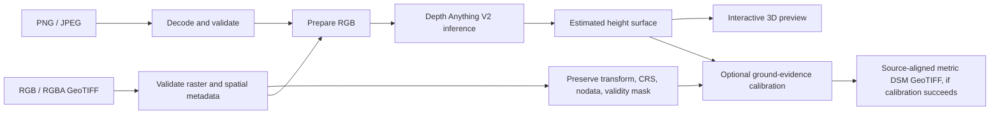

# DepthWizard

### From aerial RGB imagery to an interactive 3D surface

DepthWizard estimates surface height from a single aerial image, then turns the result into a navigable 3D scene. It accepts ordinary images for relative-height visualization and georeferenced GeoTIFFs for an optional, evidence-based metric DSM export.

> Metric elevation is conditional: GeoTIFF coordinates alone do not establish height scale. A metric DSM is exported only when the input has usable spatial metadata and calibration has sufficient ground-elevation evidence or valid ground-control points.

## Overview

Single-image depth models estimate relative structure, not surveyed elevation. DepthWizard applies a fine-tuned Depth Anything V2 model to aerial RGB imagery and provides tools to inspect the resulting surface, buildings, and slopes. For a GeoTIFF, a calibration step can map estimated height to metric elevation and write a source-aligned DSM GeoTIFF.

The project is a local prototype for reconstruction and inspection. Its current benchmark examples are deterministic fixtures, not independent survey validation; see [validation status](docs/validation/landscape-validation.md) before interpreting accuracy claims.

## Two input paths

| Input | Processing | Result |
| --- | --- | --- |
| PNG or JPEG | Decode and validate, preprocess RGB, estimate height | Relative estimated nDSM for 3D inspection; no geographic coordinates or absolute height claim |
| RGB/RGBA GeoTIFF | Validate bands, CRS, affine transform, nodata, and valid pixels; preserve source alignment and validity | Estimated surface preview; optional calibrated DSM download when ground evidence supports calibration |



## What it does

- Reconstructs large images with overlapping 518 × 518 tiles, 50% overlap, weighted blending, and horizontal-flip test-time augmentation.
- Provides a 3D scene with terrain and building geometry, semantic overlays when the selected model supplies them, height inspection, slope visualization, and orbit, fly-through, and top-down navigation.
- Preserves valid-pixel handling and source georeferencing through the GeoTIFF workflow; failed or unsupported calibration is reported rather than silently presented as metric output.
- Includes GAMUS data audit and multitask training workflows for height, semantic classes, and building boundaries.
- Provides landscape comparison examples and metric displays for exploring the evaluation workflow. The checked-in benchmark fixtures are not held-out metric validation data.

## What it is, and is not

| DepthWizard is | DepthWizard is not |
| --- | --- |
| A single-image aerial surface reconstruction prototype | A replacement for LiDAR, stereo mapping, or a surveyed DSM |
| A relative-height visualizer for PNG/JPEG inputs | A source of absolute elevation from ordinary image pixels |
| A GeoTIFF workflow that can export calibrated, georeferenced DSMs when evidence is adequate | A guarantee that every GeoTIFF can be calibrated or that its output is survey-accurate |
| A local interactive 3D inspection tool | Proof of accuracy across urban, sparse, hilly, and forested landscapes |

## Local setup

### Requirements

- Python 3.10+ with the backend requirements supported by your platform
- Node.js and npm
- A fine-tuned checkpoint compatible with DepthWizard, such as `dinosaur.pth`
- Internet access on the first live inference if the Hugging Face base model is not already cached

### Install

```bash
cd backend
python3 -m venv .venv
.venv/bin/python -m pip install -r requirements.txt

cd ../frontend
npm install
```

Put the checkpoint at the repository root as `dinosaur.pth`, or set `DEPTHWIZARD_CHECKPOINT` to its absolute path. Then start both services from the repository root:

```bash
./scripts/start-local.sh
```

Open <http://localhost:5173>. The frontend uses the FastAPI backend on port 8000. On macOS, start Uvicorn with the backend virtual-environment Python; using another Python installation can load an incompatible PyTorch/OpenMP runtime.

Uploads are limited to 256 MB by default. Set `DEPTHWIZARD_MAX_UPLOAD_BYTES` to change the limit for a controlled local demo.

## GeoTIFF calibration and export

Upload an RGB or RGBA GeoTIFF containing valid CRS and affine-transform metadata. To request metric calibration, provide either a ground elevation or valid ground-control points. Calibration can fail or remain unavailable when spatial metadata, valid ground pixels, or control points are insufficient. In that case, the estimated surface remains relative and no metric DSM should be claimed.

The exported DSM is aligned to the source raster and preserves its geospatial metadata and validity mask. Calibration provenance and confidence describe the supplied evidence and fit; they do not independently verify accuracy against a surveyed reference. See the [calibration section in the deliverable guide](docs/hackathon-deliverable.md#evidence-and-limitations) for accepted inputs and limitations.

## GAMUS training

The optional multitask training path requires a local GAMUS dataset with `images/`, `heights/`, and `classes/` directories. It is not enabled by default in the live inference setup; semantic predictions require a compatible multitask checkpoint.

```bash
cd backend
.venv/bin/python -m training.gamus_multitask /data/gamus \
  --baseline-checkpoint /absolute/path/to/checkpoint.pth \
  --output checkpoints/gamus_multitask.pth \
  --validation-group Philadelphia
```

For the Kaggle dataset audit and final training workflow, see [Kaggle training](docs/kaggle-final-training.md).

## Repository map

```text
backend/app/        FastAPI API, model inference, geospatial calibration and export
backend/training/   GAMUS audit, model training, and evaluation workflows
frontend/src/       Upload interface, inspection tools, and Three.js scene
docs/               Deliverable, validation, and training guides
scripts/            Local startup and demo verification scripts
```

## Project status and limitations

DepthWizard demonstrates an end-to-end local workflow from image upload to estimated surface and interactive scene, with conditional GeoTIFF DSM export. The current checked-in landscape examples exercise the UI and comparison pipeline but are synthetic stress fixtures, not held-out survey measurements. GAMUS is urban-focused here; generalization to sparse, hilly, and forested scenes has not been established. Canopy, terrain relief, occlusion, and low-contrast areas can produce substantial errors.

Before presenting accuracy results, evaluate predictions against spatially aligned, metric reference data with a documented coordinate/vertical datum and held-out geographic areas. The validation workspace reports RMSE, MAE, and correlation, but those metrics are meaningful only when the reference supports metric comparison.

For the demo workflow and pre-presentation checklist, see [the hackathon deliverable guide](docs/hackathon-deliverable.md).
